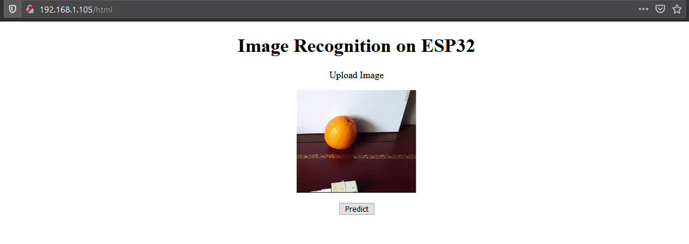

# ESP32
In this project, I will try to run a **computer vision application on ESP32**. 
 - The application should be able to oranges and apples apart in pictures.   
 - The application will be running on a web server on the ESP32 itself.

### Steps

- [x] Blinking ESP32 (using each of *esp-idf* and *arduino*)
- [x] Running a *Hello, World* web server on ESP32.
- [x] A server with HTML and JS to upload pictures. 
- [x] Running SPIFFS, passing pictures to ESP32 through SPIFFS. 
- [ ] Running ML model on ESP32.

### Progress

